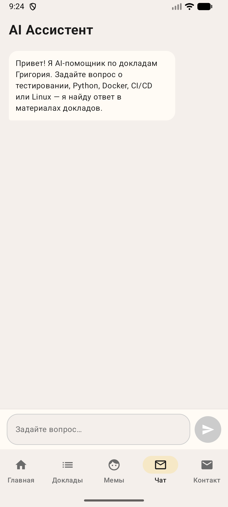
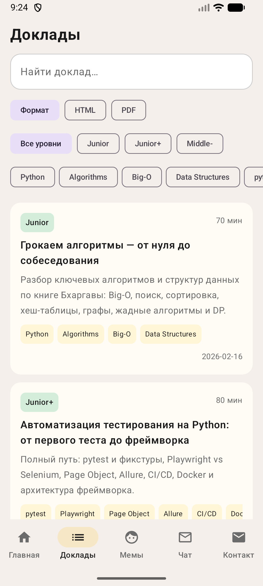
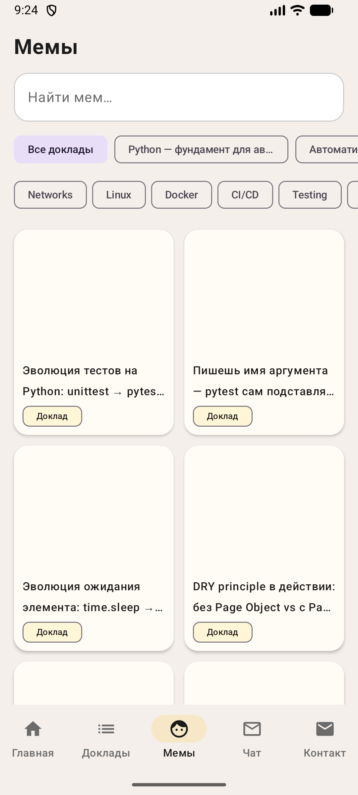

# TalksApp - Mobile Companion for QA Portfolio

[](https://github.com/GrigoriyZvygintsev/TalksApp/actions/workflows/android-ci.yml)


RU: Мобильное приложение на Kotlin + Jetpack Compose для просмотра докладов, мемов и контактов, с AI-чатом поверх API сайта-портфолио.

EN: Kotlin + Jetpack Compose mobile app for browsing talks, memes, contacts, and using an AI chat powered by the portfolio website API.

---

## Screenshots

| Home | Talks | Memes |
|---|---|---|
|  |  |  |

---

## Project Overview / Обзор проекта

RU:
- Навигация по 5 вкладкам: Главная, Доклады, Мемы, Чат, Контакты.
- Контент подгружается из локальных JSON-ассетов (`talks.json`, `memes.json`).
- AI-чат интегрирован с `https://qa-portfolio-beryl.vercel.app/api/chat`.
- Для тестирования предусмотрены `TestTags` и модульная структура экранов.

EN:
- 5-tab navigation: Home, Talks, Memes, Chat, Contacts.
- Content is loaded from local JSON assets (`talks.json`, `memes.json`).
- AI chat integration uses `https://qa-portfolio-beryl.vercel.app/api/chat`.
- Test-friendly structure with dedicated `TestTags` and screen-level modules.

---

## Architecture / Архитектура

```text
app/src/main/java/com/gzvyagintsev/talks/
  data/
    model/          # Talk, Meme models
    repository/     # TalksRepository, MemesRepository, ChatRepository
    ServiceLocator  # lightweight DI
  navigation/       # NavHost + routes
  ui/
    components/     # reusable composables
    screens/        # home/talks/memes/chat/contacts
    theme/          # colors, typography, app theme
```

RU: Приложение строится вокруг Compose UI + репозиториев данных + простой DI через `ServiceLocator`.

EN: The app is built around Compose UI, data repositories, and lightweight DI via `ServiceLocator`.

---

## Tech Stack

- Kotlin
- Jetpack Compose + Material 3
- Navigation Compose
- ViewModel + StateFlow
- Gson (JSON parsing)
- Coil (image loading)
- GitHub Actions (CI)

---

## Local Run / Локальный запуск

### Requirements

- Android Studio (latest stable)
- Android SDK Platform 36
- JDK 17 (recommended for Gradle/AGP stability)

### Build and Run

```bash
git clone https://github.com/GrigoriyZvygintsev/TalksApp.git
cd TalksApp
./gradlew assembleDebug
```

RU: Если на машине активен Java 25, укажите JDK 17 для Gradle (`JAVA_HOME` на JDK 17 в текущей сессии).

EN: If Java 25 is active on your machine, point Gradle to JDK 17 (`JAVA_HOME` set to JDK 17 for the current shell).

---

## CI

Workflow: `.github/workflows/android-ci.yml`

- Trigger: `push` / `pull_request` to `main`
- Environment: Ubuntu + Temurin JDK 17
- Check: `./gradlew assembleDebug`

---

## Roadmap

- [ ] Add release workflow (signed APK/AAB + GitHub Release)
- [ ] Add UI tests for key user journeys
- [ ] Add offline caching policy for remote AI responses

---

## Related Projects

- API tests: https://github.com/GrigoriyZvygintsev/autotests-api
- UI tests: https://github.com/GrigoriyZvygintsev/autotests-ui
- Mobile tests (Appium): https://github.com/GrigoriyZvygintsev/autotests-mobile
- Web demo: https://qa-portfolio-beryl.vercel.app/

